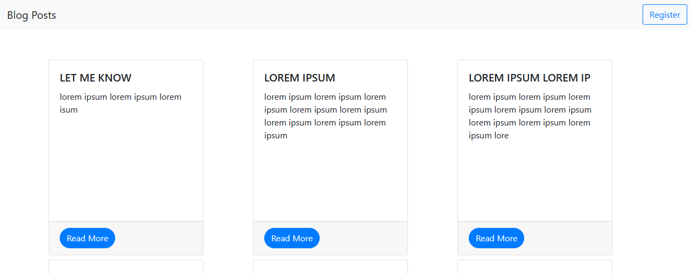
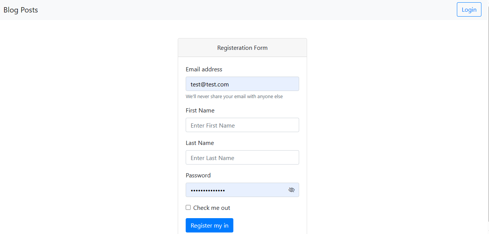
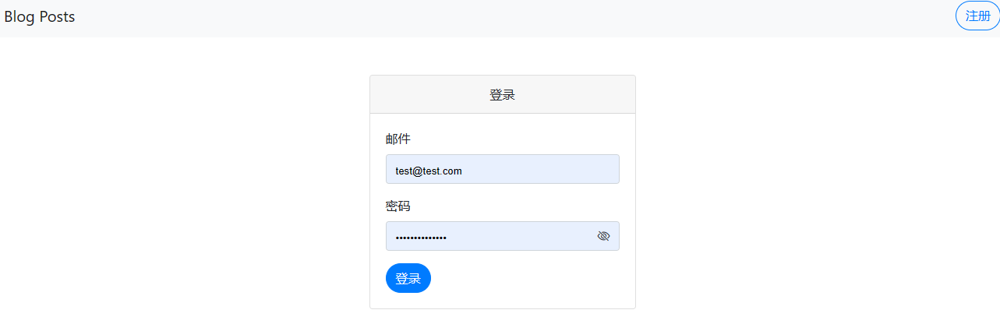
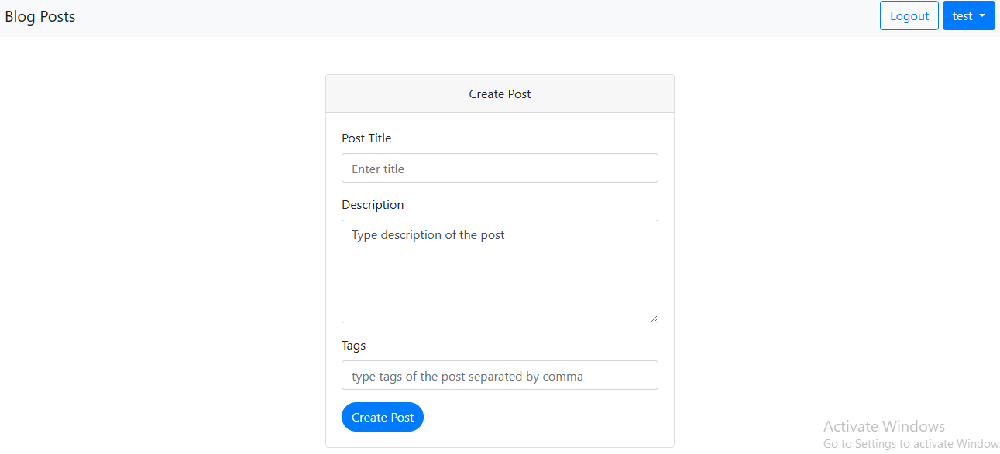
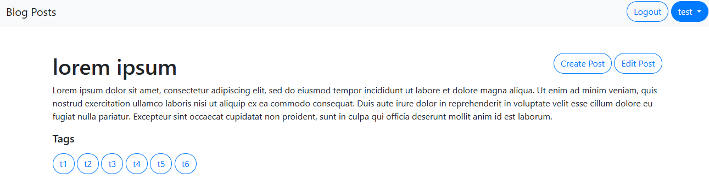

# Blog Posts Project
### An app that can create blogs. The main purpose to create this app to practice django skills and make the source code available online for other developers to start this repo for their own custom need
Using this app, you can
1. create an account, update the user password, login to the website
2. fetch the user detail using API
3. create a token for API validation
4. localization has been implementated for english and chinese languages. You can pass a get params lang=en|zh
5. create, update a post. Every post require admin approval
6. every post can be bookmark/unbookmark on user request
7. On updating the password, system will fire an email to the related user. You need to make sure all the settings are properly setup in settings.py and .env files. If you want to skip sending the email, make sure to set EMAIL_HOST_EXIST as None. No further changes are required.







## Setup (Recommended)
1. install anaconda
2. create an environment using
```
 conda create -n "django-blog-posts" python=3.10
 ```
3. run
```
conda activate django-blog-posts
```
4. run
```
pip install -r requirements.txt
```
5. replace file name in blog_posts/copy_settings.py to settings.py
6. you need to setup database(mysql) in ```.env``` file. Just replace .env.backup to .env and add db credentials
7. install ```redis``` and change your server path in ```.env``` file
7. create a database ```django_blog_posts``` in the database
8. run migrations using
```
python manage.py migrate
```
9. run
 ```
 python manage.py runserver 0.0.0.0:8080
 ```

# Auto Deployment using Github Actions
1. you may refer to [deployment.yml](/.github/workflows/deployment.yml) file in github Action for deployment
2. refer to [deployment_using_uwsgi](/deployment_using_uwsgi.md) for deploying using uwsgi
3. refer to [deployment using gunicorn](/deployment.md) for deploying using gunicorn

# Dockering Version
1. run command
```
docker-compose up
```
For reference check [DockerFile](/Dockerfile) and [docker-compose.yml](/docker-compose.yml)
## locationlization rules
1. install gettext. follow django documentation or Google it
2. following commands can be handy while creating locationlization
    1. run
    ```
    django-admin makemessages --locale=zh --extension=html,txt,py
    ```
    2. run
    ```
    django-admin compilemessages
    ```

## Information
1. super user credentials: username: test_user  password:test_user

## Next JS frontend
You can refer to [this path for next js](/frontend-react/)
Last but not least, don't forget to [our website](https://nextjs.lyskills.com)
## Technical Knowledge
1. custom middleware has been created for language translation ```middlewares.LanguageTransMiddleware```
2. django session and token validation has been implemented
3. front end has been developed using Jquery & Bootstrap
4. ```Postman collection has been made online for public use```
5. django custom template tags and filter
6. Serializer, form validation have been implemented
7. ``` Postgre support is included. You need to change the credentials in settings.py ```
8. we have set postgre database as default database. if you are curious to change it to mysql. change replace default1 key with default in
settings.py

## Deployment
To deploy using Nginx and uwsgi, please refer to following [link](/deployment.md)

# FAST API
you may refer to [fast_api](/fast_api/) for all API ends point.
```Note: you may not get db schema as I am using the same django db schema.
Further Do not forget to check the swagger documentation by visiting the

** your_server/docs **
```
For deployment of **Fast APi using gunicorn,uvicorn,hypervisor and nginx** Please refer to [this](fast_api_deployment.md)

## Common Commands
```
python manage.py migrate
```
```
python manage.py runserver
```
```
python manage.py collectstatic
```
```
docker exec -it blog_post /bin/bash
```
```
conda activate django-blog-posts
```
```
pip list
```
```
 python manage.py test
```
### Django Test cases

1. to app specific test cases,Run
```
 python manage.py test auths
```
2. to tag specific test cases, run. Two tags are used in the project ```slow``` and ```fast```
```
 python manage.py test --tags=slow
```

## mysql commands
```
CREATE USER 'root2'@'localhost' IDENTIFIED BY 'root2';
```
```
GRANT ALL PRIVILEGES ON * . * TO 'root2'@'localhost';
```
```
FLUSH PRIVILEGES;
```

## Amazon Deployment
You can open [this](http://web-django.eba-ch3dwa3n.us-east-1.elasticbeanstalk.com/) to check deployment on Amazon Elastic Beanstalk. For source code, Please [open me](https://github.com/NoumanAhmad448/web_django/tree/master/app)


## Website Links
1. https://django.lyskills.com
2. https://test-django.lyskills.com
3. https://fastapi.lyskills.com
4. https://flask.lyskills.com
5. https://ec2-user-django.lyskills.com
6. http://dev-web-django.eba-ch3dwa3n.us-east-1.elasticbeanstalk.com
7. http://web-django.eba-ch3dwa3n.us-east-1.elasticbeanstalk.com/
8. https://nextjs.lyskills.com
